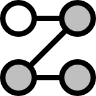

<table>
  <tr>
    <td></td>
    <td><h1>Plcoding: A Python Library for the Research of Polar Codes</h1></td>
  </tr>
</table>

这是一个关于极化码（polar codes）的Python库。最初供我自己做科研使用，现在开源到github，希望能够帮助到做相关研究、或者单纯是对信息论与编码技术感兴趣的同学们。

库中提供了基于极化码的信道纠错、信源压缩等Python模块，主要目的是辅助科学研究和理论分析，并不打算实现工业级别的解决方案。如果你对极化码的实用化感兴趣，不妨以这个库为基础进行开发。毕竟相比Matlab一类的偏仿真模拟的工业语言，Python这样的通用编程语言具有更良好的设计范式，更适合方便快速地集成到其他系统中。

Plcoding库配套一册基于Jupyter Notebook的在线免费文档，其中给出了大量的**可执行代码**，并配有详实的文字说明。撰写该手册的最初目的是用于助教工作，而现版本则可以视作一本极化码入门手册。其中第一章在没有对理论原理进行深入介绍的情况下，直接给出了明确的构造、编码和译码算法，适合那些不希望深入了解极化原理、只希望实现一份简单但完备的极化码解决方案的同学们。

如果对你有帮助，请务必在github页面右上角，点击star支持本项目~

**这次一定！**

## 手册

👉 [Plcoding用户手册](https://renzichang.github.io/plcoding/)

## 细节

这个库包括如下几个子模块：

- **`plcoding`**  
  包括一些常用的基本函数，例如：
  - 熵的计算与逆运算
  - 极化码的递归编码
  - 比特反转置换（bit-reversal permutation）
  - 二进制擦除信道（binary erasure channel）构造法
  - 矩阵的Kronecker幂运算
  - ...

- **`plcoding.channel`**  
  用于支持初级的信道纠错极化码研究，包括：
  - 常用信道，如AWGN信道、比特翻转信道等
  - 常用调制算法，如BPSK、QAM，以及对应的软/硬判决算法
  - 基于SC译码的信道极化码
  - ...

- **`plcoding.source`**  
  用于支持初级的信源压缩极化码研究，包括：
  - 几种经典的无失真极化压缩技术
  - 一个高性能的适配pytorch的实用极化压缩器
  - ...

- **`plcoding.research`**  
  用于支持进阶的极化码研究，包括：
  - 密度演化（density evolution）构造法
  - 单调链（Monotone chain）极化码
  - 限失真信源编码
  - ...

- **`plcoding.cpp_core`**  
  - 高性能计算的核心部分，部分其他模块是对该核心的Python封装
  - 这部分源码是可见的，如果浏览并确定已经理解了它们的工作方式，可以绕过封装直接使用

## 安装

这个库使用`pybind11`来绑定C++模块到Python，并且使用了FFTW3来加速卷积运算，因此环境需求为：

- C++（源码编译）
  - FFTW3

- Python3（运行环境）
  - pybind11
  - numpy

下载源码到本地、并配好环境之后，进入CMakeLists.txt同级目录，执行pip的本地安装指令：

```bash
pip install .
```

## 开发进度

- 已实现：
  - C++核心功能模块，包括快速极化模块、通用的SC译码器模块（2025.05.25）
  - plcoding模块下的部分基本函数（2025.05.27）
  - 配套手册的基本内容已完成（2025.06.03）
  - plcoding.channel模块下的channel类和modulator类（2025.06.04）

- 待实现
  - plcoding.channel模块下的coder类
  - plcoding.source模块
  - plcoding.research模块
  - 整数到比特流的映射函数
  - ...

### License

MIT License

## 开发者

欢迎在github提交issue，或者私下交流：

- 📧 Email: [rzc1937986979@163.com](mailto:rzc1937986979@163.com)
- 💬 QQ: 1937986979
